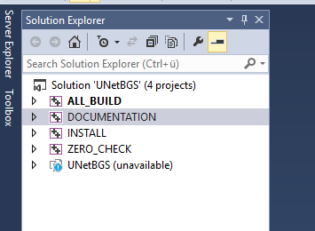

# UNetBGS - Package documentation # {#mainpage}

## General description

This is a library provides a TensorFlow based UNet for Background Segmentation
It was developed to segment electronic parts on circuit boards.

## Versions

| Versions        				|  		Date				|    Person						|	Tested Generators			|		Tested OS		|  
| ------------- 				| ------------- 			| ------------- 				|	 -------------	     		|	 -------------      |
| 1.0.1     					| 10.08.2018				|	Bernhard Föllmer			|	Spyder, Python 3.6 			|		WIN 10, 64bit	|

## Requirements

### Functional requirements
-	Python 3.6
-	OpenCV 3.0.0
- 	TensorFlow

### Non-Functional requirements
-	

## Installation

### Full installation based on conda

- conda create -n env_UNET python=3.6
- activate env_UNET
- conda install -c anaconda spyder
- conda install -c conda-forge opencv
- conda install -c anaconda pyqt
- conda install -c conda-forge tensorflow
- conda install -c anaconda scipy 
- conda install -c anaconda pillow
- conda install -c conda-forge matplotlib

- conda install -c anaconda pyqt

If you get the following error :
"An HTTP error occurred when trying to retrieve this URL.
HTTP errors are often intermittent, and a simple retry will get you on your way."
then try '''conda config --set ssl_verify no'''

## Dependencies

### Required

| Dependency        								|  		Version						|    Description 								|
| ------------- 									| -------------						|	------------- 							 	|
| OpenCV3						     				| v3.4.1							|												|
| TensorFlow     									| v1.10.0							|												|

### Optional

| Dependency        								|  		Version						|    
| ------------- 									|:-------------:					|
| -   												| -								|

## Sources

https://github.com/Berni1557/UNetBGS.git

## TODO

## User documentation

If the doxygen docu was build, the docu should be here: [Docu](html\index.html).

You can build doxygen documentation easily by running CMake. 
There might be the following error: "CMake Error: CMake can not determine linker language for target: UNetBGS" which can be ignored.
Select your prefered generator (tested with VS2012) and compile the DOCUMENTATION project.
The documentation should be in your build folder. Open html/index.html in your browser to see the documentation.

## Developers

-	Bernhard Föllmer, berniweb@posteo.de

----------------------------
